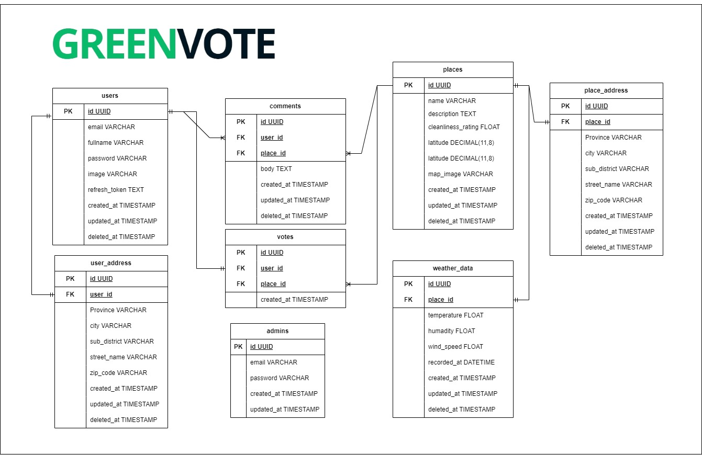

# <span style="color: green;">Green</span><span style="color: black;">Vote</span>

## About Project

GreenVote adalah sistem e-voting inovatif yang ditujukan untuk restorasi lingkungan. Sistem ini menyediakan platform bagi publik untuk berpartisipasi aktif dalam memberikan suara untuk tempat-tempat yang membutuhkan restorasi lingkungan. Tujuannya adalah untuk meningkatkan partisipasi publik dan menyuarakan aspirasi kolektif untuk mencapai lingkungan yang lebih bersih dan sehat.

## Features

### User

- Login
- Melihat Semua tempat
- Memberikan Suara/vote
- Komentar
- Chatbot

### Admin

- Kelola Data User
- Kelola DataTempat yang akan divote
- Kelola Data Cuaca

## Tech Stacks


- **Framework:** Echo Framework
- **Database:** MySQL
- **Library:** GORM
- **Deployment:** AWS EC2 & RDS
- **Containerization:** Docker
- **Authentication:** JWT
- **External APIs:** Bing Maps API, OpenWeather API
- **CI/CD:** GitHub Actions
- **Version Control:** Git & GitHub
- **Image Storage:** Cloudinary
- **Domain Management:** Cloudflare

## API Documentation

API documentation tersedia di [Swagger](https://app.swaggerhub.com/apis-docs/LEAFTHE78/green-vote_api/1.0.0).

## ERD dan HLA

**ERD**


**HLA**


## Setup

**Clone the repository:**

```
git clone https://github.com/SimpleMan2022/miniproject-GreenVote.git
```

**Navigate to the project directory:**

```
git clone https://github.com/SimpleMan2022/miniproject-GreenVote.git
```

**Copy the .env.example file to .env and configure the environment variables:**

```
git clone https://github.com/SimpleMan2022/miniproject-GreenVote.git
```

**Install the dependencies:**

```
go mod tidy
```

**Run the application:**

```
go run main.go
```
